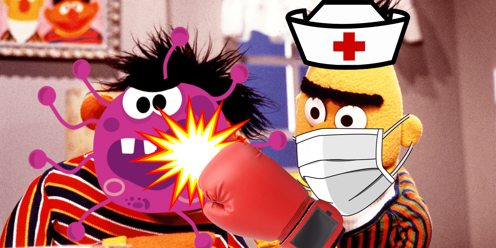

# Covid-BERTs

This repository contains information on two BERT versions pretrained on a preprocessed version of the [CORD-19](https://www.kaggle.com/allen-institute-for-ai/CORD-19-research-challenge) dataset, namely **ClinicalCovidBERT** and **BioCovidBERT**. 




## Contribution

 This project was inspired by the `covid_bert_base` [model](https://huggingface.co/deepset/covid_bert_base) from Deepset and [discussions](https://www.kaggle.com/allen-institute-for-ai/CORD-19-research-challenge/discussion/138250) on potential improvements of this model on Kaggle. The contribution of this project is based on two pillars:
- better initialization: the training is initialized with existing BERT versions trained on scientific corpuses, namely [ClinicalBERT](https://github.com/EmilyAlsentzer/clinicalBERT) and [BioBERT](https://github.com/dmis-lab/biobert).
- specialized vocabulary: the customized vocabulary provided on the [BioBERT repository](https://github.com/dmis-lab/biobert), used for training [BioBERT-Large v1.1 (+ PubMed 1M)](https://github.com/dmis-lab/biobert), is used to train `biocovid-bert-large-cased`. 

## Download

| Model                            | Downloads
| -------------------------------- | ---------------------------------------------------------------------------------------------------------------
| `clinicalcovid-bert-base-cased`   | [`config.json`](https://s3.amazonaws.com/models.huggingface.co/bert/manueltonneau/clinicalcovid-bert-base-cased/config.json) • [`tensorflow model`](https://s3.amazonaws.com/models.huggingface.co/bert/manueltonneau/clinicalcovid-bert-base-cased/clinicalcovid_bert_base_cased.ckpt.zip) • [`pytorch_model.bin`](https://s3.amazonaws.com/models.huggingface.co/bert/manueltonneau/clinicalcovid-bert-base-cased/pytorch_model.bin) • [`vocab.txt`](https://s3.amazonaws.com/models.huggingface.co/bert/manueltonneau/clinicalcovid-bert-base-cased/vocab.txt)
| `biocovid-bert-large-cased` | [`config.json`](https://s3.amazonaws.com/models.huggingface.co/bert/manueltonneau/biocovid-bert-large-cased/config.json) • [`tensorflow model`](https://s3.amazonaws.com/models.huggingface.co/bert/manueltonneau/biocovid-bert-large-cased/biocovid_bert_large_cased.ckpt.zip) • [`pytorch_model.bin`](https://s3.amazonaws.com/models.huggingface.co/bert/manueltonneau/biocovid-bert-large-cased/pytorch_model.bin) • [`vocab.txt`](https://s3.amazonaws.com/models.huggingface.co/bert/manueltonneau/biocovid-bert-large-cased/vocab.txt)


## ClinicalCovidBERT 

### Model and training description

- BERT base default configuration
- Cased 
- Initialized from [Bio+Clinical BERT](https://github.com/EmilyAlsentzer/clinicalBERT)
- Using English `bert_base_cased` default vocabulary
- Using whole-word masking
- Pretrained on a preprocessed version of the CORD-19 dataset including titles, abstract and body text (approx. 1.5GB)
- Training parameters:
  - `train_batch_size`: 512
  - `max_seq_length`: 128
  - `max_predictions_per_seq`: 20
  - `num_train_steps`: 150000 
  - `num_warmup_steps`: 10000
  - `learning_rate`: 2e-5

### Usage

```python
from transformers import AutoTokenizer, AutoModel
tokenizer = AutoTokenizer.from_pretrained("manueltonneau/clinicalcovid-bert-base-cased")
model = AutoModel.from_pretrained("manueltonneau/clinicalcovid-bert-base-cased")
```

## BioCovidBERT

### Model and training description

- BERT large default configuration
- Cased 
- Initialized from [BioBERT-Large v1.1 (+ PubMed 1M)](https://github.com/dmis-lab/biobert) using their custom 30k vocabulary
- Using whole-word masking
- Pretrained on the same preprocessed version of the CORD-19 dataset including titles, abstract and body text (approx. 1.5GB)
- Training parameters:
  - `train_batch_size`: 512
  - `max_seq_length`: 128
  - `max_predictions_per_seq`: 20
  - `num_train_steps`: 200000 
  - `num_warmup_steps`: 10000
  - `learning_rate`: 2e-5
  
### Usage

```python
from transformers import AutoTokenizer, AutoModel
tokenizer = AutoTokenizer.from_pretrained("manueltonneau/biocovid-bert-large-cased")
model = AutoModel.from_pretrained("manueltonneau/biocovid-bert-large-cased")
```


## References

Emily Alsentzer, John Murphy, William Boag, Wei-Hung Weng, Di Jin, Tristan Naumann, and Matthew McDermott. 2019. Publicly available clinical BERT embeddings. In Proceedings of the 2nd Clinical Natural Language Processing Workshop, pages 72-78, Minneapolis, Minnesota, USA. Association for Computational Linguistics.

Lee, Jinhyuk, et al. "BioBERT: a pre-trained biomedical language representation model for biomedical text mining." Bioinformatics 36.4 (2020): 1234-1240.
BioBERT

Reimers, N., & Gurevych, I. (2019). Sentence-bert: Sentence embeddings using siamese bert-networks. arXiv preprint arXiv:1908.10084.

## Acknowledgements

Research supported with Cloud TPUs from Google's TensorFlow Research Cloud (TFRC)
